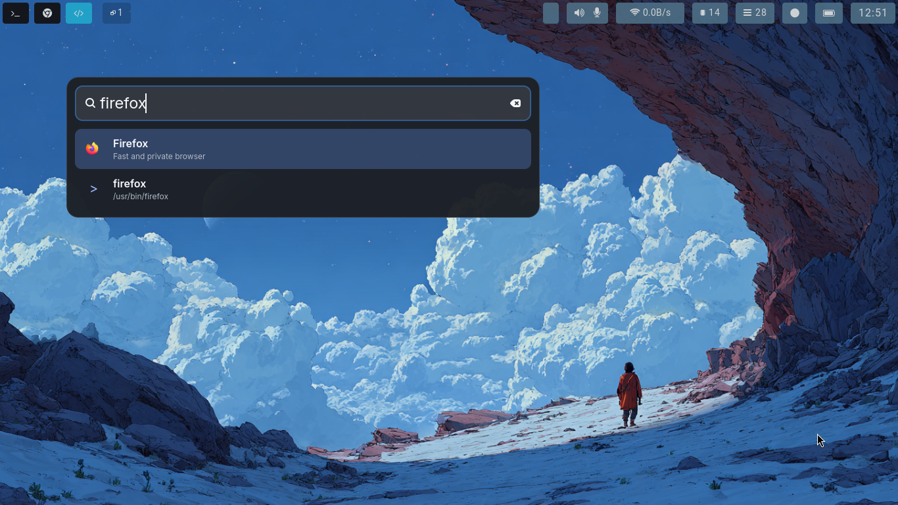

# Spotter

A fast application launcher for Linux, written in Rust.

## Features

- Native GTK command palette UI.
- Searches installed desktop apps from `.desktop` files.
- Shows each application's original themed or file-based icon when available.
- Optionally searches executable commands from `PATH`.
- Indexes configured home folders and supports absolute paths.
- Parallel fuzzy search with a small bounded result list for responsive typing.
- Shows recently launched apps and web searches when the input is empty.
- Persists query history for GNU Readline-style editing and navigation.
- Optionally stays available through a search-style system tray icon.
- Opens apps, shell commands, files, and directories with `Enter`.
- Loads configuration from `~/.config/spotter/config.toml`.

## Screenshots




## Run

```sh
cargo run --release
```

## Build

```sh
make
```

The binary is created at:

```sh
target/release/spotter
```

You can also build it directly with `cargo build --release --bin spotter`.

## Install

Install system-wide under `/usr/local/bin`:

```sh
sudo make install
```

For a per-user installation, use:

```sh
make install PREFIX="$HOME/.local"
```

`PREFIX`, `BINDIR`, and `DESTDIR` can be overridden for packaging or custom
installation layouts.

## Configuration

Spotter creates this file on first launch:

```sh
~/.config/spotter/config.toml
```

The annotated [config.example.toml](config.example.toml) is also compiled into
the binary as the first-launch default. Copy it to start from a fresh config:

```sh
mkdir -p "$HOME/.config/spotter"
cp config.example.toml "$HOME/.config/spotter/config.toml"
```

Sway supports all documented anchors, including `top-right`, and applies
`window_width` exactly. The result pane grows naturally up to
`result_max_height`. Other Wayland compositors control placement unless they
provide a compatible positioning API.

Invalid TOML cannot be applied. Spotter shows the parse error in the launcher
and uses defaults until the file is corrected. Restart Spotter after editing
configuration values.

Set `max_recent_items` to control how many launched apps and web searches are
shown when the input is empty, or set it to `0` to disable the recent list.
Web entries are explicitly tagged as web searches. The list is stored at
`~/.local/share/spotter/recent-items.json`.

`max_recent_searches` separately controls the query history used by Readline
navigation such as `Ctrl+P/N`. Set it to `0` to disable query history. Queries
are stored at `~/.local/share/spotter/recent-searches.json`.

Set `include_path_binaries = true` to index executable files found in `PATH`.
It defaults to `false`, so command binaries are excluded unless explicitly
enabled.

Set `system_tray = true` to keep Spotter running after its window is hidden.
Clicking the search icon presents the launcher again; its context menu also
offers Open and Quit actions. A StatusNotifierItem-compatible tray host is
required.

## Global Shortcut

On Linux, global shortcuts are desktop-environment specific, especially under Wayland. Bind your preferred shortcut to:

```sh
spotter
```

Examples:

- GNOME: Settings -> Keyboard -> View and Customize Shortcuts -> Custom Shortcuts.
- KDE Plasma: System Settings -> Shortcuts -> Custom Shortcuts.
- i3/sway: bind a key to `exec spotter`.

## Notes

The first launch builds the in-memory index on a background thread. Application
results, plus optional `PATH` commands, are published first, followed by
filesystem entries. An active query refreshes automatically as each indexing
stage completes.

Common editing shortcuts include `Ctrl+A/E/B/F`, `Alt+B/F`, `Ctrl+H/D`,
`Ctrl+W/U/K/Y/T`, `Alt+D/Backspace`, and `Ctrl+P/N` for older/newer queries.
